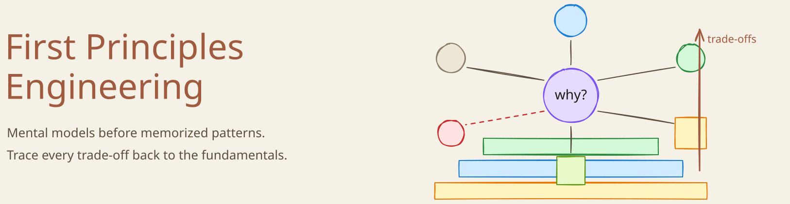
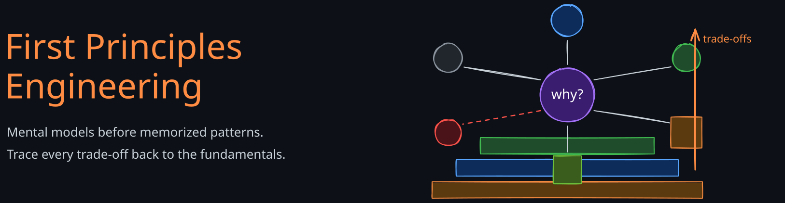

# First Principles Engineering

<strong><a href="about">Sandeep Chauhan</a></strong> · Senior Software Engineer @ LinkedIn

Writing about software engineering foundations, system design interviews, and AI systems — built from the ground up, not from buzzwords. Curated notes I'm willing to be wrong about in public.

<figure class="fpe-hero-figure">
  
  
</figure>

## Start with a roadmap

<a class="fpe-roadmap-card" href="03-roadmaps/foundations-roadmap">
  
    <svg xmlns="http://www.w3.org/2000/svg" viewBox="0 0 24 24" fill="none" stroke="currentColor" stroke-width="2" stroke-linecap="round" stroke-linejoin="round"><polygon points="3 6 9 3 15 6 21 3 21 18 15 21 9 18 3 21 3 6"/><line x1="9" y1="3" x2="9" y2="18"/><line x1="15" y1="6" x2="15" y2="21"/></svg>
    Roadmap
  
  Foundations Roadmap
  For newer engineers and gap-filling: networking, APIs, databases, caching, distributed systems, and production basics.
  Start here
</a>

<a class="fpe-roadmap-card" href="03-roadmaps/system-design-interviews-roadmap">
  
    <svg xmlns="http://www.w3.org/2000/svg" viewBox="0 0 24 24" fill="none" stroke="currentColor" stroke-width="2" stroke-linecap="round" stroke-linejoin="round"><polygon points="3 6 9 3 15 6 21 3 21 18 15 21 9 18 3 21 3 6"/><line x1="9" y1="3" x2="9" y2="18"/><line x1="15" y1="6" x2="15" y2="21"/></svg>
    Roadmap
  
  System Design Interviews Roadmap
  For interview prep: turn requirements into APIs, storage, caches, queues, scale, reliability, and trade-off narratives.
  Interview prep
</a>

<a class="fpe-roadmap-card" href="03-roadmaps/ai-systems-roadmap">
  
    <svg xmlns="http://www.w3.org/2000/svg" viewBox="0 0 24 24" fill="none" stroke="currentColor" stroke-width="2" stroke-linecap="round" stroke-linejoin="round"><polygon points="3 6 9 3 15 6 21 3 21 18 15 21 9 18 3 21 3 6"/><line x1="9" y1="3" x2="9" y2="18"/><line x1="15" y1="6" x2="15" y2="21"/></svg>
    Roadmap
  
  AI Systems Roadmap
  Understand the engineering around the model: data quality, retrieval, serving, evaluation, cost, latency, and observability.
  Growing roadmap
</a>

## Recommended Reads

<a class="fpe-article-card" href="01-fundamentals/05-ai-ml/04-rag-architecture">
  AI Systems
  RAG Architecture
  The most-deployed LLM pattern in production is mostly a retrieval system with a model bolted on — not the other way around.
</a>

<a class="fpe-article-card" href="01-fundamentals/02-databases/01-fundamentals/06-mvcc">
  Databases
  MVCC
  Uber's 2016 migration from Postgres to MySQL forced the community to reckon with what "multi-version" actually costs in practice.
</a>

<a class="fpe-article-card" href="01-fundamentals/01-concepts/01-distributed-systems/03-consensus-algorithm">
  Distributed Systems
  Consensus Algorithms
  Paxos, Raft, and why Lamport spent eight years arguing about Greek allegory before "Paxos Made Simple" finally shipped.
</a>

<a class="fpe-article-card" href="01-fundamentals/01-concepts/04-caching/02-consistent-hashing">
  Caching
  Consistent Hashing
  The textbook ring is a classroom curiosity. Virtual nodes are what makes it work in production — and most explanations skip them.
</a>

<a class="fpe-article-card" href="01-fundamentals/01-concepts/01-distributed-systems/02-logical-clocks">
  Distributed Systems
  Logical Clocks
  Lamport imported special relativity into distributed systems because physical timestamps quietly lie under clock skew.
</a>

<a class="fpe-article-card" href="01-fundamentals/01-concepts/01-distributed-systems/05-distributed-transactions">
  Distributed Systems
  Distributed Transactions
  Two-phase commit, Jim Gray's disappearance, and the cruel irony of a community that couldn't coordinate finding its own founder.
</a>

<a class="fpe-article-card" href="01-fundamentals/01-concepts/03-data/02-change-data-capture">
  Data
  Change Data Capture
  Why dual writes always drift. CDC reframes the database write-ahead log as the source of truth — not an implementation detail.
</a>

<a class="fpe-article-card" href="01-fundamentals/01-concepts/05-api/04-grpc-rpc">
  APIs
  gRPC vs REST
  REST works until JSON parse cost dominates your CPU bill and bolted-on WebSockets become load-bearing. Then it doesn't.
</a>

<a class="fpe-article-card" href="01-fundamentals/04-networking/05-load-balancers">
  Networking
  Load Balancers
  Round robin is the easy part; the production lesson is that health checks, connection stickiness, and L4/L7 choices decide the outage.
</a>

<a class="fpe-article-card" href="01-fundamentals/04-networking/02-http-1-2-3">
  Networking
  HTTP/1.1, HTTP/2, and HTTP/3
  The API looks the same until TCP head-of-line blocking, multiplexing, and QUIC explain where the latency really went.
</a>

## About this project

  

    Learning in public
    First Principles Engineering
    Curated notes from a larger private notebook
  

  

    
Start with a roadmap when you want structure. Use search when you already know the concept. The site intentionally keeps learning paths few and clear so the homepage does not become another notes folder.

    
<a class="about-strip-link" href="about">About this site →</a> · <a class="about-strip-link" href="index.xml">RSS feed →</a>

  

